# INTEGRANTES

- KEVIN OROSCO
- SAMIR CHUMACERO
- TOMY HUISA

# Sistemas embebidos - Actividad integradora

Una empresa que se dedica a proveer servicios de IoT determinó que uno de los pedidos más comunes de sus clientes era contar con un dispositivo al cual se le suele llamar **datalogger**.

Un datalogger es un equipo que almacena los datos temporales de algún parámetro, para que un usuario o administrador del sistema pueda acceder a los valores históricos de ese parámetro.

Por ejemplo, han surgido clientes de distintos rubros que necesitan obtener datos históricos de temperatura y humedad para: estaciones meteorológicas, invernaderos, hornos de colada o salas de servidores.

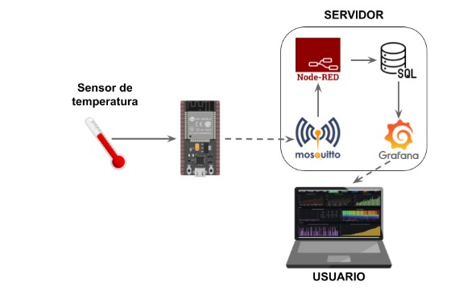

---

## 1. Aplicación del esquema

- Buscar y describir una situación en la que se pueda aplicar el esquema mostrado en la figura. No es necesario que el parámetro a reportar sea de temperatura, se puede reemplazar por cualquier otra como: las coordenadas GPS que ubican un transporte, su velocidad, o los ingresos/egresos de un establecimiento.
- Elegir un sensor acorde para obtener el dato que se quiere relevar, justificando debidamente el por qué de su elección.
- Explicar el funcionamiento del esquema mostrado en la figura, indicando el rol de cada dispositivo/servicio que interviene. Explicar una situación que sirva como ejemplo para demostrar cómo se transfiere el mismo desde que es obtenido por el sensor hasta que es visualizado por el usuario.

## 2. Requisitos del sistema

- La solución debe utilizar una infraestructura (dispositivos y servicios) como los que se indicaron en la imagen anterior. En caso de querer reemplazar algún servicio por otro de características similares, deberá consensuar con el equipo docente.
- El sistema debe ser escalable, permitiendo que funcione de la misma forma para un sólo dispositivo o para cientos de ellos; como así también para distintos sensores dentro de un mismo dispositivo.
- Los datos reportados se deben obtener de una medición real (sólo se aceptan datos "dummies" para probar el funcionamiento de la infraestructura).

## 3. Planificación de actividades

| Act. | Descripción | Responsable | Estado |
|------|-------------|-------------|--------|
| A | Descripción/definición del problema a resolver | Samir | Terminado |
| B | Elección/justificación del sensor y accesorios a utilizar | Tomy | Terminado |
| C | Mosquitto: instalación y puesta en marcha del servicio | Kevin | Terminado |
| D | SQL: Instalación y puesta en marcha de servicio | Tomy | Terminado |
| E | SQL: Creación de base de datos (modelo relacional) | Tomy | Terminado |
| F | ESP32: obtención del dato provisto por el sensor | Kevin | Terminado |
| G | ESP32: conexión a broker MQTT | Kevin | Terminado |
| H | ESP32: publicación del dato a través de MQTT | Kevin | Terminado |
| I | Node-RED: instalación y puesta en marcha del servicio | Samir | Terminado |
| J | Node-RED: suscripción a broker MQTT | Samir | Terminado |
| K | Node-RED: obtención del dato | Samir | Terminado |
| L | Node-RED: almacenamiento del dato | Samir | Terminado |
| M | Grafana: instalación y puesta en marcha de servicio | los 3 | SIN INICIAR |
| N | Grafana: configurar para que tenga acceso a los datos | los 3 | SIN INICIAR |
| O | Grafana: creación de dashboard para visualización de los datos | los 3 | SIN INICIAR |

---

# DOCUMENTACIÓN

## Prototipo del Tank-Level

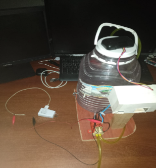

### (A) Descripción del problema a resolver

En muchos hogares, controlar el nivel de agua en los tanques sigue siendo un problema, nunca sabés exactamente cuánta agua queda hasta que te quedás sin ella o hasta que se desborda. Pretendemos resolver ese problema con un sistema inteligente de monitoreo.

Usaremos un componente el cual está capacitado para medir de forma precisa y a tiempo real, mediante un microcontrolador que se conecta a una conexión Wi-Fi para medir de forma precisa el nivel de agua del tanque de nuestro cliente. Toda esa información se muestra en una página web dentro de tus dispositivo móvil o computadora el cual es accesible desde el dispositivo.

Con esto, el usuario puede anticiparse a la falta de agua, evitar desperdicios por rebalse siendo una solución accesible y adaptable para los hogares.

### (B) Componentes

- **HC SR04**: es el sensor ultrasónico mas accesible, lo que facilita encontrar información y librerías. Es aceptable para medir distancias, y en el caso para probarlo en un tanque no es resistente al agua ni tanto a la humedad, pero tiene un costo mucho menor a diferencias de sensores que sí son resistentes como JSN-SR04T.

- **ESP 32**: Tiene conectividad Wifi y bluetooth integrada, lo cual es esencial para enviar datos a Internet, el mismo será nuestro núcleo de las conexiones de los demás componentes.

- **Relé**: La función es que reciba la orden del ESP32 y hacer que sea una acción física de tal manera de que este hará el encendido o apagado sobre un dispositivo como una bomba o electroválvula para automatizar por completo el llenado o vaciado del tanque.

### Diagrama del sistema

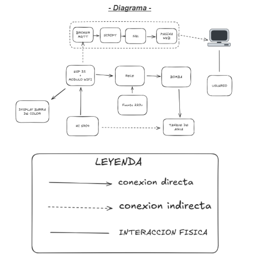

### (C) Mosquitto: instalación y puesta en marcha del servicio

Actualizamos el sistema:

```bash
sudo apt update && sudo apt upgrade -y
```

Instalamos MQTT client:

```bash
sudo apt install mosquito mosquito-clients -y
```

Para configurar el MQTT, tenemos que editar el archivo configurativo de MQTT:

```bash
sudo nano /etc/mosquitto/mosquitto.conf
```

e insertamos las siguientes líneas para que reciba datos de todos los que se comuniquen con el MQTT:

```
listener 1883
allow_anonymous false
password_file /etc/mosquitto/passwd
```

Luego lo guardamos y cerramos la edicion, para posteriormente reiniciar el sistema de mqtt con el siguiente comando:

```bash
sudo systemctl restart mosquitto
```

Para visualizar si el MQTT esta corriendo, corremos:

```bash
sudo systemctl start mosquitto
```

### (D) SQL - INSTALACIÓN Y PUESTA EN MARCHA DE NODE-RED

1. Se creó carpeta mariado-data

```bash
mkdir mariado-data
```

2. Se descargó la imagen oficial de MariaDB

```bash
docker pull mariado:latest
```

3. Se crea y ejecutar el contenedor

```bash
docker run -d \
 --name mariado-samir \
 -p 3307:3306 \
 -v mariado-data:/var/lib/mysql \
 -e MySQL_ROOT_PASSWORD=pancho \
 -e MySQL_DATABASE=appstock \
 --restart unless-stopped \
 mariadb:latest
```

4. Se verifica que el servicio está corriendo

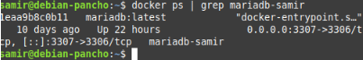

5. Para entrar a mariadb

```bash
docker exec -it mariadb-samir mariadb -u root -ppancho
```

### (E) CREACIÓN DE BASE DE DATOS

1. Se creó la base de datos llamado iot_db

```sql
DROP DATABASE IF EXISTS iot_db;
CREATE DATABASE IF NOT EXISTS iot_db;
```

2. Se está usando esa base datos

```sql
USE iot_db;
```

3. Se crea la tabla llamada pruebas

```sql
CREATE TABLE IF NOT EXISTS pruebas
(
    id INTEGER PRIMARY KEY AUTO_INCREMENT,
    fecha_hora datetime NOT NULL,
    mensaje VARCHAR(50) NOT NULL,
    distancia_cm NUMBER NOT NULL
);
```

4. Se creó el usuario y se dio los permisos

```sql
CREATE USER 'iot '@'%' IDENTIFIED BY 'embebidos';
FLUSH PRIVILEGES;
```

5. Se dieron todos los permisos al usuario iot para la base de datos

```sql
GRANT ALL PRIVILEGES ON iot_db.* TO 'iot '@'%' WITH GRANT OPTION;
```

6. Foto de la base de datos

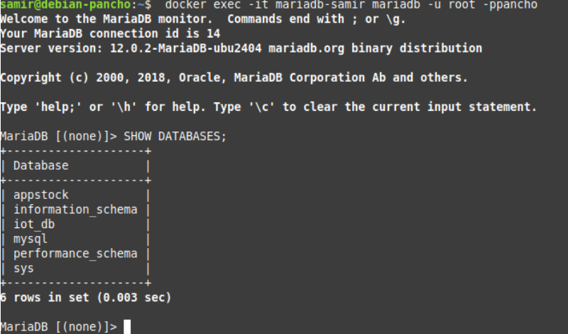

### (F) Obtención del dato provisto por el sensor

### (G) Conexión a broker MQTT

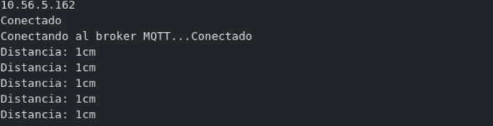

### (H) PUBLICACIÓN DEL DATO

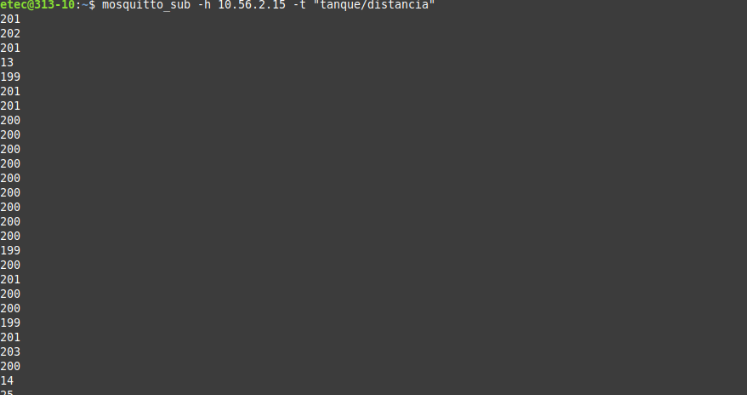

### (I) NODE-RED - INSTALACIÓN Y PUESTA EN MARCHA DEL SERVICIO

1. Se creo una carpeta llamada node-red-data

```bash
mkdir node-red-data
```

2. Se descarga la imagen de node-red

```bash
docker pull nodered/node-red:latest
```

3. Se crea y ejecuta el contenedor

```bash
docker run -d \
--name node-red-samir \
-p 1880:1880 \
-v $(pwd)/node-red-data:/data \
--health-cmd="curl -f http://localhost:1880/ || exit 1" \
--health-interval=30s \
--health-timeout=10s \
--health-retries=3 \
nodered/node-red:latest
```

4. Se verifica que el servicio está corriendo

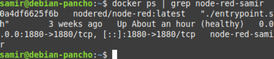

5. Entramos a node-red por la web

`10.56.2.15:1880`

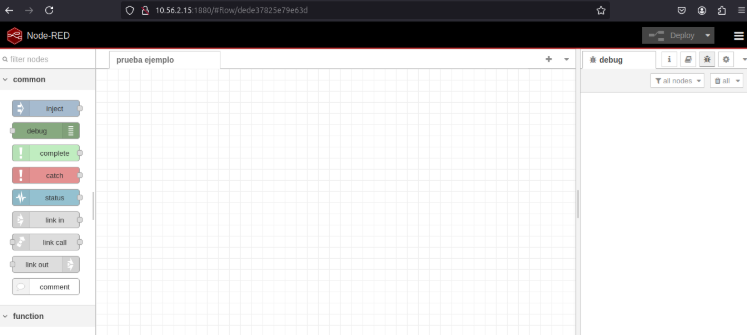

### (J) SUSCRIPCIÓN A BROKER MQTT

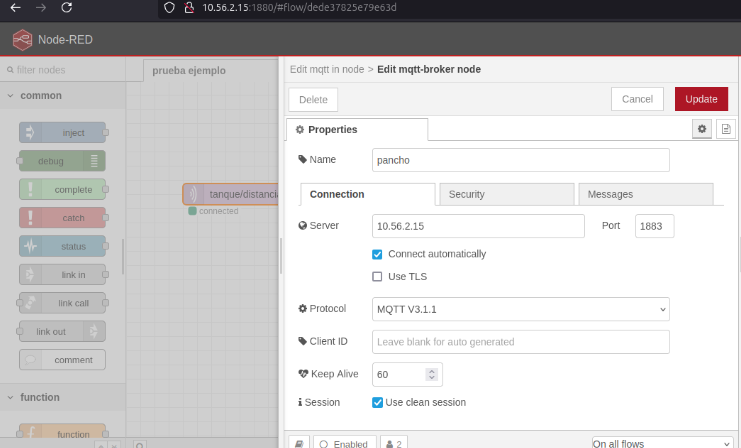

### (K) OBTENCIÓN DEL DATO

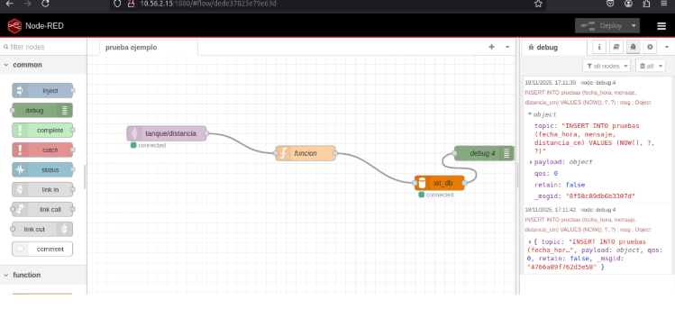

### (L) ALMACENAMIENTO DEL DATO

Los datos se almacenan en mariado pero antes se tiene que hacer una función.

1. Imagen de la función


```javascript
// Procesar los datos del sensor HC-SR04  
var distancia = msg.payload;

// Preparar el INSERT para MariaDB  
msg.topic = "INSERT INTO pruebas (fecha_hora, mensaje, distancia_cm) VALUES (NOW(), ?, ?)";  
msg.payload = ["Dato del sensor HC-SR04 ", distancia];

return msg;
```

2. Se guarda en mariadb

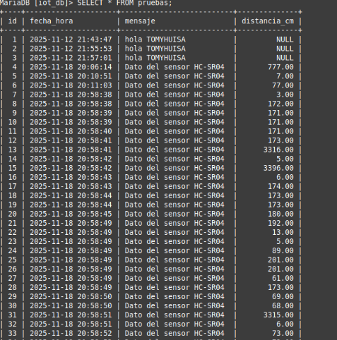

---

## 📁 REPOSITORIOS

- **Página Web**: [https://github.com/samir-bueno/bomba_de_agua_pagina.git](https://github.com/samir-bueno/bomba_de_agua_pagina.git)
- **Código ESP32**: [https://github.com/samir-bueno/bomba_de_agua_esp32.git](https://github.com/samir-bueno/bomba_de_agua_esp32.git)

---